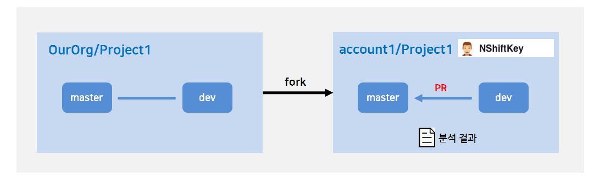

NShiftKey should work in conjunction with Github. Just by installing NShiftKey app on Github repository, NShiftKey completes the setup and the repository is continuously monitored. Static analysis is performed automatically whenever pull request occurs.

> A static analysis of NShiftKey (including open source analysis) is performed periodically when a pull request occurs.

---

## Contents
1. [Installation](#Installation)
2. [How to perform security analysis](#How-to-perform-security-analysis)
3. [Analysis report](#Analysis-report)
4. [Features](#Features)
5. [Uninstallation](#Uninstallation)

---

## Installation
- Connect NShiftKey and click Configure.
  - [https://github.com/apps/nshiftkey](https://github.com/apps/nshiftkey)

- Select the organization to install NShiftKey.

- Choose "Only select repositories" and then select the repository where you want to install the NShiftKey.

- To complete the installation, press the save button to apply the changes.

> Caution! If you select "All repositories", NShiftKey is applied to all repositories in the organization.

> If you cannot find the repository, search by the repository name.

> In some cases, security-checker installation may require approval from the organization owner.

### How to install NShiftKey: According to the type of use cases

- Describes how to install NShiftKey, depending on the type of use.

#### [CASE 1]
##### Only one repository
- Proceed to install the app in the repository you use.

#### [CASE 2]
##### Using forked repository and analyzing every Pull Request to the main repository
- Proceed to install the app in the main repository.
- Do not need to install app in the forked repository.
- The analysis report can be received in the main repository.

> Caution: To perform opensource vulnerability scanning on a forked repository, you also need to install the app on a forked repository.(If the app is not installed in the forked repository, Opensource vulnerability scanning is performed on the main repository.) For more information, please refer to the "Target branch of Opensource vulnerability scanning" on the link. [link](https://github.com/pages/naver/nshift-doc/2-opensource-analysis/requirement/)

#### [CASE 3]
##### Using forked repository and internal analyzing of the forked repository
- Proceed to install the app in the forked repository.
- Do not need to install app in the main repository.
- The analysis report can be received in the forked repository.

---

## How to perform security analysis
NShiftKey provides three types of security vulnerability analysis: source code static analysis, web page dynamic analysis, and opensource library analysis. If NShiftKey is installed, it is easy to perform above analysis.

- Methods for performing the analysis are as follows:
  - Source code static analysis
    - Automatically perform analysis to find security vulnerabilities in the source code when generating a pull request.
  - Opensource library analysis
    - Automatically perform analysis to find vulnerable opensource libraries program use when generating a pull request.
  - Web page dynamic analysis
    - When you register the server information to perform the scan, NShiftKey performs the analysis automatically at set intervals you set.Please refer to the link below for how to register server information.

- You can also start static analysis in the following ways:
  - Generate pull request
    - Automatically starts analysis when creating a Pull Request

  - Pull request comment
    - You can perform re-run analysis by attaching a comment that says "ok to check" on the Conversation tab
    - This is useful when you want to perform a static analysis again without additional pull requests, or if you want to perform a static analysis on a pull request without an existing test history

 
- For more information on the analysis, please refer to the link below.

[Source code static analysis](https://naver.github.io/nshiftkey-doc/1-static-analysis/requirement/)
 
[Opensource library analysis](https://naver.github.io/nshiftkey-doc/2-opensource-analysis/requirement/)

---

## Analysis report
- You can receive all the analysis results in the repository. Please refer to the table below for the reporting channel.

Type of analysis | Reporting channel
-- | -- |
Source code static analysis | Check tab of Pull Request
Opensource library analysis | Check tab of Pull Request

- For more information on the reports of the analysis, please refer to the link below.

[Report of source code static analysis](https://naver.github.io/nshiftkey-doc/1-static-analysis/report/)
 
[Report of opensource library analysis](https://naver.github.io/nshiftkey-doc/2-opensource-analysis/report/)

---

## Features 
- NShiftKey has the following features for your convenience:   

1. If the reported security vulnerability is already known issue, the Ignore Warning feature helps you to exclude it from the next analysis.
  - [link](https://naver.github.io/nshiftkey-doc/4-best-practice/ignore_issues/)
 
2. Customizing Setting helps you to set the level of detection vulnerabilities and analysis scope of project. Also, this feature helps you to exclude unwanted rules.
  - [link](https://naver.github.io/nshiftkey-doc/4-best-practice/customize_settings/)

3. You can set up to analyze only modified files.
  - [link](https://naver.github.io/nshiftkey-doc/4-best-practice/differential_analysis/)

---

## Uninstallation
- To uninstall NShiftKey, connect to the security-checker and choose the repo you want to delete. Then click the "X" next to repo name and save.
  - [https://github.com/apps/nshiftkey](https://github.com/apps/nshiftkey)

