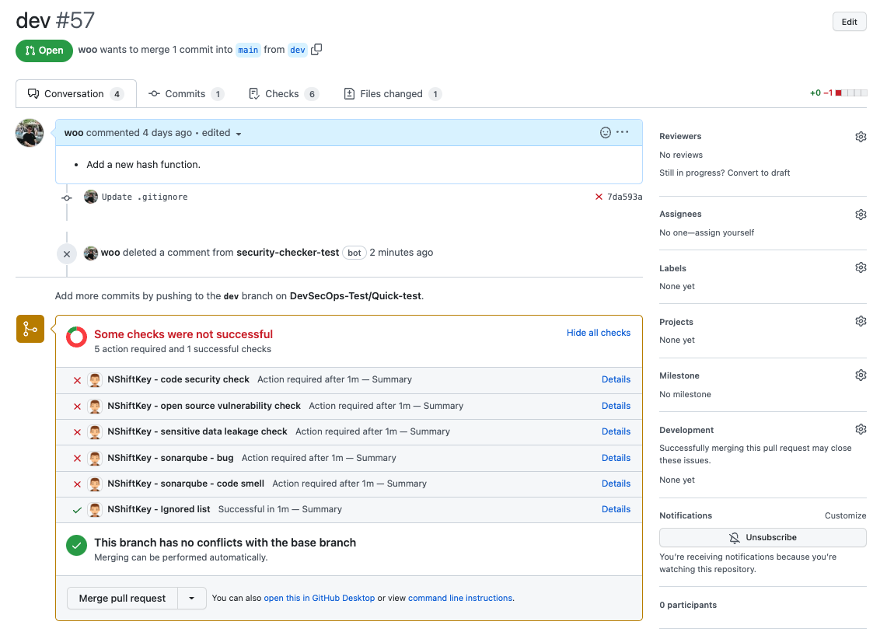

Static analysis report can be checked as follows.

First, you can show a summary of the overall results in PR.

#### code security check
This tab displays the results of scanning your code for security vulnerabilities.

#### open source vulnerability check
This tab displays the results of open source vulnerability that is being used by projects.

#### sensitive data leakage check
This tab displays the results of scanning your code for sensitive data leakage.

#### sonarqube - bug / code smell
This tab displays the results of SonarQube bug / code smell.

> Please refer to link for more information about issue type of SonarQube. [(link)](https://docs.sonarqube.org/latest/user-guide/issues/)

> the results of the Vulnerability check of SonarQube are integrated into the "code security check" tab.

Specific context of results can be found by clicking Details or Checks menu.

