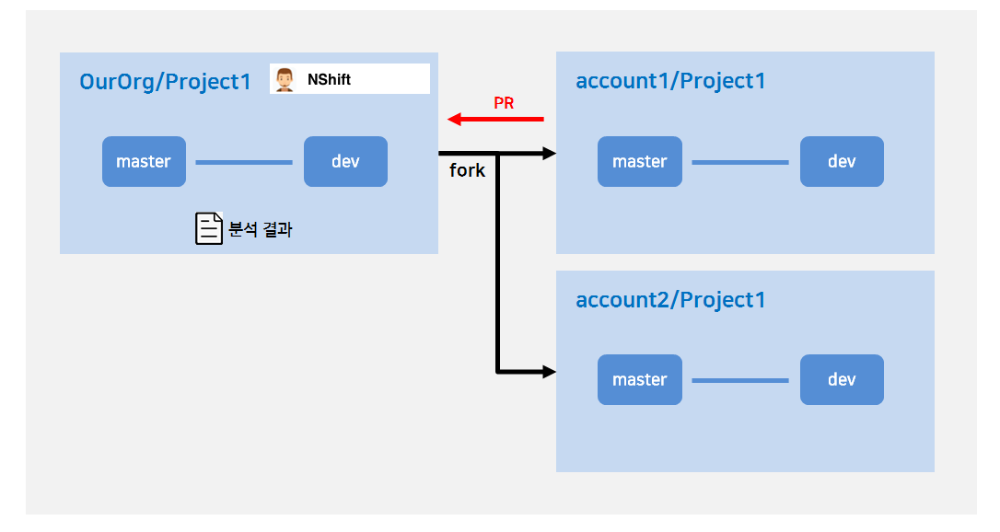

### Trigger condition of Opensource vulnerability scanning

NSfhitKey performs Opensource vulnerability scanning. 
When PR occurs, NShiftKey automatically analyzes the repository to find opensource libraries in use and scan vulnerabilities.

### Target branch of Opensource vulnerability scanning
By default, Target branch of Opensource vulnerability scanning is the source branch of the PR.
But, if you use it in the form below, target branch of Opensource vulnerability scanning is the target branch of the PR.
* Forking the team's repository as a personal account. NShiftKey is installed in the team's repository but not personal repository.

> To perform opensource vulnerability scanning on a forked repository, you also need to install the app on a forked repository. (If the app is not installed in the forked repository, Opensource vulnerability scanning is performed on the main repository)

> NShiftKey detects the language of repository through language detection API provided by Github.
Github's API provides a language distribution based on default branch of repository. 
Therefore, some analyses may not be performed if language composition between target branch and default branch is different. ( ex) If default branch is empty, analysis does not proceed even if there are contents in target branch.)

### Required file for Opensource vulnerability scanning

Each language has a file associated with the package manager, which must exist in the repository so that 
can analyze the opensource library(dependency).

The following files are required for each language and package manager: (Each file must exist in the project folder or subdirectory.)

Language | Package manager | Required file
-- | -- | --
Java | Maven | pom.xml
Java | Gradle | build.gradle
Javascript | NPM (Yarn) | package.json
Python | PIP | requirements.txt
Go | Dep | gopkg.lock, gopkg.toml
Go | Modules | go.mod, go.sum
C (C++) | CMake | cmakelists.txt
Ruby | Bundler | gemfile
Objective C (Swift) | CocoaPods | podfile.lock

> In the case of cmakelists.txt, only libraries included in the "include" can be analyzed.
