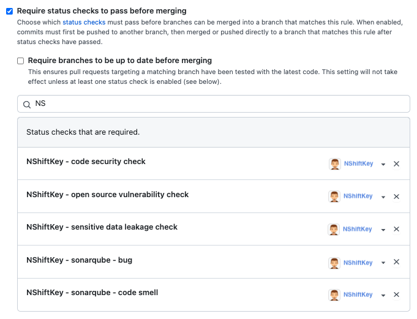
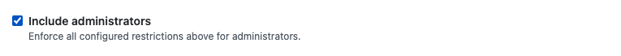
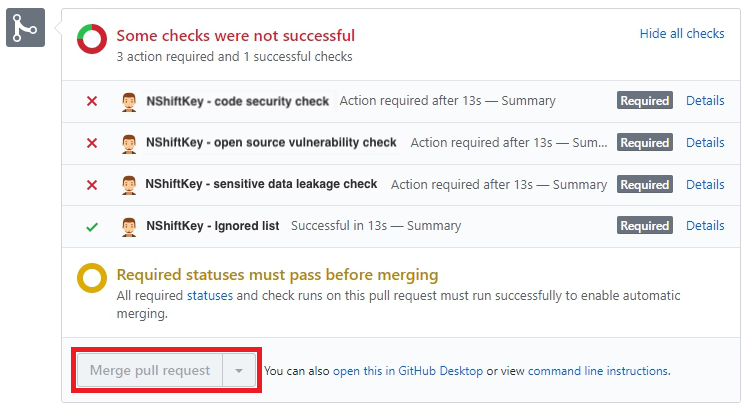

### Status checks before merging

You can change the repository setting to block merge when security scan result is not passed. 
Go to "Settings->Branches->Branch protection rules->Add rule" and check "Require status checks to pass before merging". Then merge alert can be made when a vulnerability exists.

By default, the feature does not apply to the administrator. 
If you check "Include administrators", the administrator also applies. 

> "Merge pull request" button will be disabled if any of the inspection items on NShiftKey have failed to pass.

