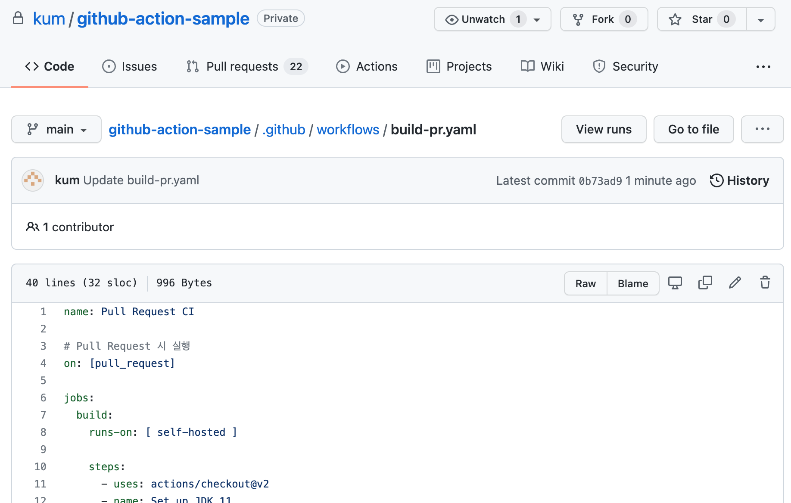
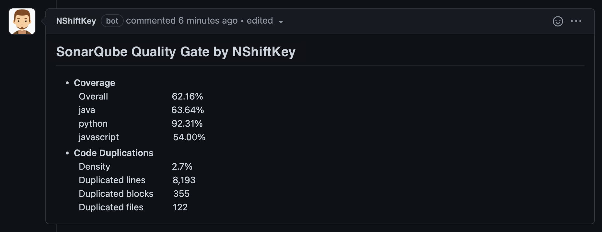

### Coverage information function
* NShiftKey can provide security analysis results and coverage by analyzing the test coverage report.

### Precondition
* Requires pull request build and coverage test environment using Github Actions on OSS
* Actions Runner must be able to use *curl*
* 'security_check.rc' to set '[SonarqubeMetricComment](https://github.com/pages/naver/nshiftkey-doc/4-best-practice/customize_settings/)' value to 1

### Supported format

language | coverage tool | format 
-- | -- | --
Java|JaCoCo | XML 
JavaScript| nyc | lcov
Go | go test | gcov
Python3 | pytest-cov | xml

### How to apply
1. (If necessary) Added action yaml to OSS to perform coverage test at pull request (PR)
    

2. Added step to upload coverage report to NShiftKey
    * Explanation
        - Upload coverage report to NShiftKey using curl command
        - The coverage file is passed through the *-F "language=coverage_filepath"* parameter.
            - <b>Coverage file path needs to be modified</b> for each build environment
            - For multi-language projects, add *-F* option for each language
            
    * 언어별 커버리지 리포트 업로드 step 작성법
        - java jacoco
            ```
                - name: Upload coverage to NShiftKey
                    run: |
                    curl -X POST https://nshiftkey.naver.com/coverage \
                        -H "repository:${{ github.repository }}" \
                        -H "pr_ref:${{ github.ref }}" \
                        -F "java=@${{ github.workspace }}/build/reports/jacoco/test/jacocoTestReport.xml"
            ```

        - javascript nyc
            ```
                - name: Upload coverage to NShiftKey
                    run: |
                      curl -X POST https://nshiftkey.naver.com/coverage \
                        -H "repository:${{ github.repository }}" \
                        -H "pr_ref:${{ github.ref }}" \
                        -F "javascript=@${{ github.workspace }}/coverage/lcov.info"
            ```

        - golang test
            ```
                - name: Upload coverage to NShiftKey
                    run: |
                      curl -X POST https://nshiftkey.naver.com/coverage \
                        -H "repository:${{ github.repository }}" \
                        -H "pr_ref:${{ github.ref }}" \
                        -F "golang=@${{ github.workspace }}/coverage.out"
            ```

        - Python3 pytest-cov
            ```
                - name: Upload coverage to NShiftKey
                    run: |
                      curl -X POST https://nshiftkey.naver.com/coverage \
                        -H "repository:${{ github.repository }}" \
                        -H "pr_ref:${{ github.ref }}" \
                        -F "python=@${{ github.workspace }}/coverage.xml"
            ```

        - multi-language (java + javascript)
            ```
                - name: Upload coverage to NShiftKey
                    run: |
                      curl -X POST https://nshiftkey.naver.com/coverage \
                        -H "repository:${{ github.repository }}" \
                        -H "pr_ref:${{ github.ref }}" \
                        -F "java=@${{ github.workspace }}/build/reports/jacoco/test/jacocoTestReport.xml"
                        -F "javascript=@${{ github.workspace }}/coverage/lcov.info"
            ```

3. After the PR is created, when the coverage test of the action is completed, a coverage comment is created in the corresponding PR.
    * Below is a case output by uploading a coverage report in three languages: java, python, and javascript
    

### AActions yaml example
* Example of action to get coverage and upload to NShiftKey using gradle and JaCoCo

    ```
    name: Pull Request CI

    # run on Pull Request
    on: [pull_request]

    jobs:
      build:
        runs-on: [ self-hosted ]

        steps:
          - uses: actions/checkout@v2
          - name: Set up JDK 11
              uses: actions/setup-java@v1
              with:
                java-version: '11'
                distribution: 'adopt'

          - name: Grant execute permission for gradlew
            run: chmod +x gradlew

          - name: Clean
            run: ./gradlew clean -PskipNode

          - name: Build gradle without test
            run: |
              ./gradlew --parallel build -x test

          # create coverage report
          - name: Run Coverage
            run: |
              chmod +x gradlew
              ./gradlew test jacocoTestReport

          # upload coverage report
          - name: Upload coverage to NShiftKey
            run: |
              curl -X POST https://nshiftkey.naver.com/coverage \
                  -H "repository:${{ github.repository }}" \
                  -H "pr_ref:${{ github.ref }}" \
                  -F "java=@${{ github.workspace }}/build/reports/jacoco/test/jacocoTestReport.xml"
    ```
