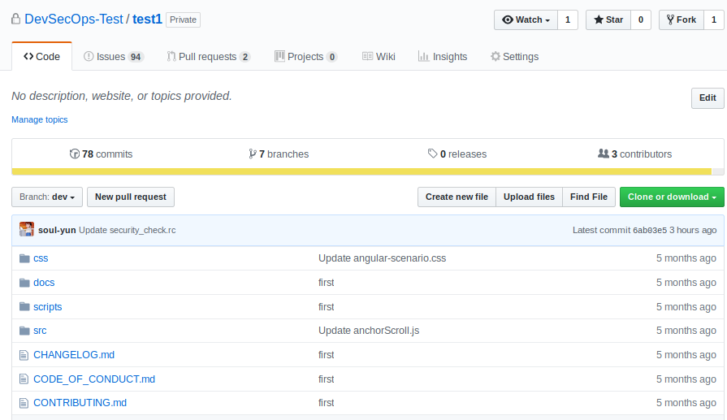
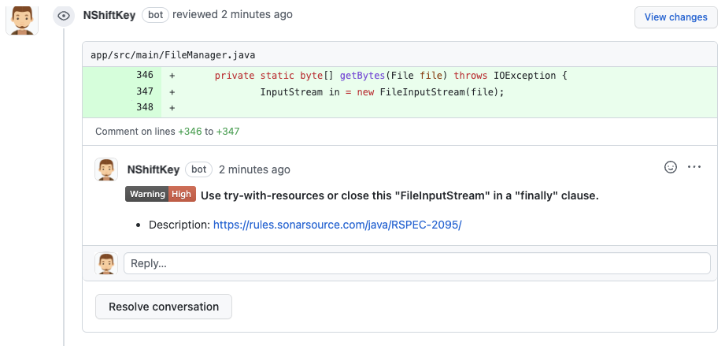
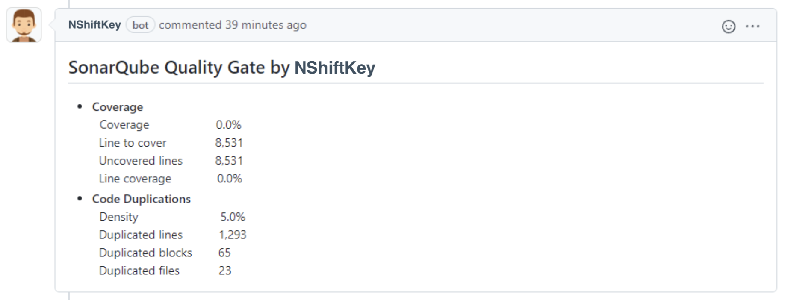

### Configuring NShiftKey setting via security_check.rc

You can configure NShiftKey setting via security_check.rc on root of repository. security_check.rc consists of JSON format and the items are as follows.

> For more detailed examples of case-specific exception handling using the security_check.rc, please refer [here](https://naver.github.io/nshiftkey-doc/4-best-practice/exception_setting/).

> The settings of ExcludeDir, ExcludeFile, and ExcludeCheckRule do not apply to open source vulnerability check.

#### ReportLevel
You can set the security vulnerability level to be reported. The security vulnerability level is set to High, Medium, and Low depending on the severity. (Default: 3)
> ReportLevel will be applied to all check(code security check, sensitive data leakage check, open source vulnerability check, sonarqube - bug, sonarqube - code smell).

value | coverage
-- | --
1 | Report vulnerabilities with high risk level
2 | Report vulnerabilities with high, medium risk levels
3 | Report vulnerabilities with high, medium, and low risk levels

#### ExcludeDir
You can set up folders to exclude from the report results. If you enter a folder path, all results including the folder path entered in the results will be excluded. (Default: Disable)
> The top of the path is the root of the repository. For example, if you want to exclude src/test from the repository (test1) in the figure below, you must enter src/test, not test1/src/test.

#### ExcludeFile
You can set up files to exclude from the report results. If you enter a filename, all results including the filename entered in the results will be excluded. (Default: Disable)
#### ExcludeCheckRule
You can set detection rules to exclude from the report results. If you enter a detection rule, all results related to the detection rule entered in the results report will be excluded. (Default: Disable)
#### ScanFileExtension
You can set up file extension to analyze only specific file extensions. Analyze will be performed only the entered extension files. (Default: Disable)
#### DifferentialAnalysis
You can set up to analyze only modified files. Please refer here[(link)](https://naver.github.io/nshiftkey-doc/4-best-practice/differential_analysis) (기본값: Disable)

Value | Description
-- | --
0 | Disable
1 | Enable

#### DynamicReportAutoClose
As soon as NShiftKey registers the dynamic analysis result as issue, it can be closed automatically. (Default: Disable)

Value | Description
-- | --
0 | Disable
1 | Enable

#### SonarVulnSeverityLevel
You can set up default level of SonarQube's Vulnerability issue type to be reported. (Default: 5)

Value | Description
-- | --
1 | Report vulnerabilities with BLOCKER
2 | Report vulnerabilities with BLOCKER, CRITICAL
3 | Report vulnerabilities with BLOCKER, CRITICAL, MAJOR
4 | Report vulnerabilities with BLOCKER, CRITICAL, MAJOR, MINOR
5 | Report vulnerabilities with BLOCKER, CRITICAL, MAJOR, MINOR, INFO

#### SonarBugSeverityLevel
You can set up default level of SonarQube's Bug issue type to be reported. (Default: 2)

Value | Description
-- | --
1 | Report vulnerabilities with BLOCKER
2 | Report vulnerabilities with BLOCKER, CRITICAL
3 | Report vulnerabilities with BLOCKER, CRITICAL, MAJOR
4 | Report vulnerabilities with BLOCKER, CRITICAL, MAJOR, MINOR
5 | Report vulnerabilities with BLOCKER, CRITICAL, MAJOR, MINOR, INFO

#### SonarCodeSmellSeverityLevel
You can set up default level of SonarQube's Code smell issue type to be reported. (Default: 1)

Value | Description
-- | --
1 | Report vulnerabilities with BLOCKER
2 | Report vulnerabilities with BLOCKER, CRITICAL
3 | Report vulnerabilities with BLOCKER, CRITICAL, MAJOR
4 | Report vulnerabilities with BLOCKER, CRITICAL, MAJOR, MINOR
5 | Report vulnerabilities with BLOCKER, CRITICAL, MAJOR, MINOR, INFO

#### PullRequestComment
Use the Comment to display what is found in the newly added or modified content. (Default: Disable)

Value | Description
-- | --
0 | Disable
1 | Enable

#### SonarqubeMetricComment
The Code Duplicate information provided by SonarQube and the Coverage information generated by Github Actions are output to the Comment. If you want to link the coverage information, you can refer to it [here](https://naver.github.io/nshiftkey-doc/4-best-practice/coverage/). (Default: Disable)

Value | Description
-- | --
0 | Disable
1 | Enable

If the [Locking conversions](https://docs.github.com/en/communities/moderating-comments-and-conversations/locking-conversations) function is turned on, a comment is not generated. If you need to create a comment, you must turn this function off.

### Precautions
> security_check.rc file must exist in the destination branch of Pull Request. security_check.rc in the other branch will not be applied.

> Wildcard characters (*) are not allowed within the security_check.rc file.

> README.md and security_check.rc files are excluded from the scan by default.

