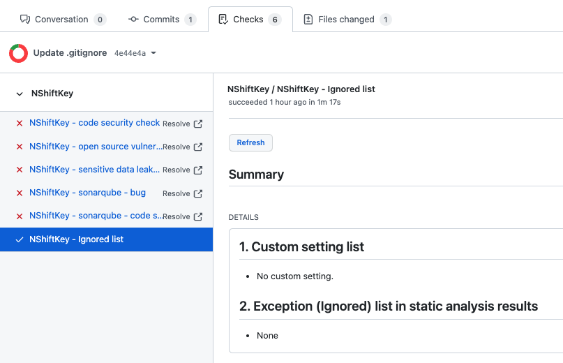
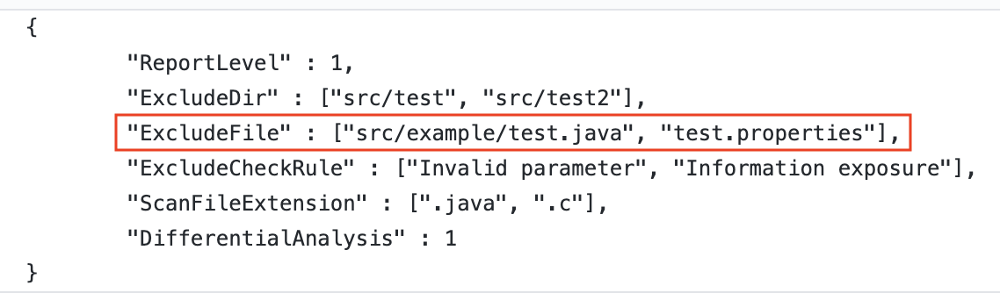
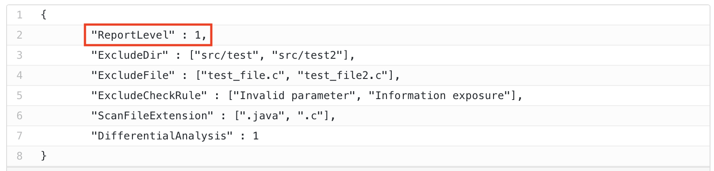
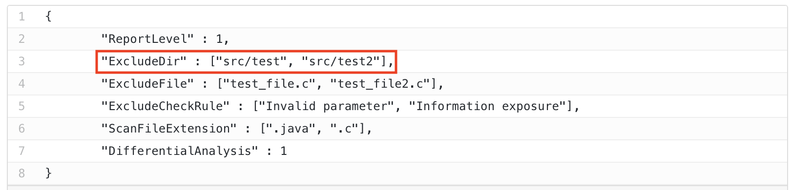
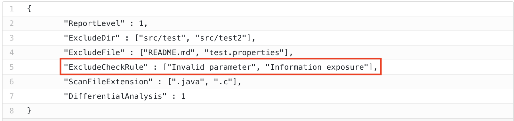

### 예외처리 설정 가이드

NShiftKey는 다양한 방법으로 예외처리 설정이 가능합니다. 아래 Case를 통해 다양한 상황에서의 예외처리 방법에 대해 알아보겠습니다.

> 예외 설정은 security_check.rc 파일을 통해 할 수 있으며, 보다 자세한 내용은 [여기](https://naver.github.io/nshiftkey-doc/4-best-practice/customize_settings)를 참고해주세요.

> ignore list는 NShiftKey 리포트 화면의 좌측 탭에서 확인 가능합니다.
> 

### 특정 파일(property 파일 등)에 민감 정보(패스워드, IP 주소, 토큰 등)를 적어놓고 사용하고 있지만 이를 NShiftKey가 리포팅하지 않게 하고 싶을 때
Github repository에는 민감 정보를 저장하지 않는 것이 최선입니다. 하지만 어쩔 수 없이 해당 정보를 hardcoding 해야 할 상황일 때, 다음과 같은 예외처리를 통해 해당 이슈가 리포팅되지 않게 할 수 있습니다.

1. security_check.rc 파일 편집
2. "ExcludeFile" 항목에 민감 정보가 포함되어 있는 파일명을 입력 (path 포함)
3. NShiftKey 검사 수행

### NShiftKey가 탐지한 보안 이슈를 중복해서 리포팅하지 않게 하고 싶을 때
NShiftKey가 탐지한 보안 이슈는 해당 이슈가 해결될 때까지 계속 리포팅 됩니다. 해당 이슈에 대해 인지하였고, 수정하기 전까지 더 이상 리포팅 받고싶지 않다면 다음과 같은 예외처리를 통해 해당 이슈가 리포팅되지 않게 할 수 있습니다.

1. NShiftKey 검사 수행
2. Checks 탭으로 이동
3. 탐지된 보안 이슈를 확인 후 "ignore this" 클릭
4. ignore list 탭에서 ignore 처리한 이슈를 확인

### 내부적으로 수정이 필요하지 않다고 판단해서 NShiftKey가 다음부터는 검출하지 않도록 하고 싶을 때
NShiftKey가 탐지한 보안 이슈를 리뷰하는 과정에서 해당 이슈가 수정이 필요하지 않다고 판단될 수 있습니다. 다음과 같은 예외처리를 통해 해당 이슈가 리포팅되지 않게 할 수 있습니다.

1. NShiftKey 검사 수행
2. Checks 탭으로 이동
3. 탐지된 보안 이슈를 확인 후 "ignore this" 클릭
4. ignore list 탭에서 ignore 처리한 이슈를 확인

### NShiftKey가 탐지한 보안 이슈가 오탐일 때
NShiftKey가 탐지한 보안 이슈가 오탐일 수 있습니다. 이 경우 다음과 같은 예외처리를 통해 해당 이슈가 리포팅되지 않게 할 수 있습니다.

1. NShiftKey 검사 수행
2. Checks 탭으로 이동
3. 탐지된 보안 이슈를 확인 후 "ignore this" 클릭
4. ignore list 탭에서 ignore 처리한 이슈를 확인

### Impact가 큰 이슈만 리포팅받고 싶을 때
만약 자신이 관리하는 repository에서 minor한 보안 이슈가 너무 많이 탐지되어 보안 이슈 관리가 힘들 수 있습니다. 이 경우 다음과 같은 예외처리를 통해 Impact가 큰 보안 이슈만 리포팅되도록 할 수 있습니다.

1. security_check.rc 파일 편집
2. "ReportLevel" 항목에 "1" 또는 "2" 이라고 입력 (1은 high 이상, 2는 medium 이상만 리포팅 됨)
3. NShiftKey 검사 수행

### Test 폴더는 탐지 항목에서 제외하고 싶을 때
일반적으로 test 용도의 파일에는 test용 데이터가 존재하며, 이로 인해 원치 않는 보안 이슈를 리포팅받을 수 있습니다. 이 경우 다음과 같은 예외처리를 통해 test 폴더 내 모든 파일을 탐지 대상에서 제외할 수 있습니다.

1. security_check.rc 파일 편집
2. "ExcludeDir" 항목에 test용 폴더명 입력 (ex : src/test)
3. NShiftKey 검사 수행

### 특정 탐지 룰에 대해 NShiftKey가 리포팅하지 않게 하고 싶을 때
NShiftKey에는 많은 수의 탐지 룰이 정의되어 있고, 해당 룰에 해당되는 모든 이슈를 리포팅 해줍니다. 다음과 같은 예외처리를 통해 특정 룰에 해당하는 이슈를 리포팅받지 않을 수 있습니다.
> NShiftKey에 정의되어 있는 룰은 [여기](https://naver.github.io/nshiftkey-doc/1-static-analysis/check_rule)에서 확인할 수 있습니다.

1. security_check.rc 파일 편집
2. "ExcludeCheckRule" 항목에 룰 이름을 입력 (ex : Invalid parameter)
3. NShiftKey 검사 수행

