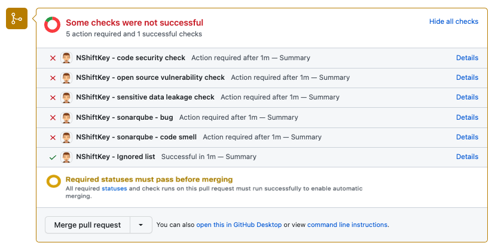
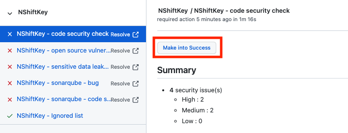
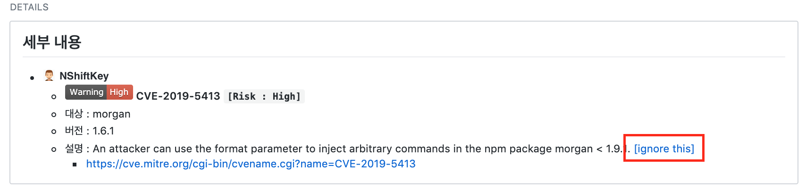
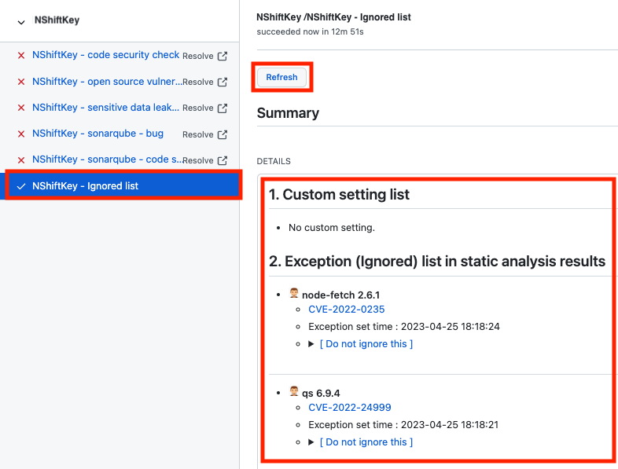

### Make into success

If NShiftKey has a branch protection rule and some vulnerabilities are detected, a warning message will be shown like below.

Click "Make into access" button to hide warning message. After that, it appears to have passed the scan.

### Ignore this

To exclude a security vulnerability detected by NShiftKey because it is either false-alarm or known issue, click [ignore this] of each detection item to make an exception.

You can view or delete the ignored item on the "Ignored list & Custom setting" tab of the Checks menu.
If you check it on the "Ignored list & Custom setting" tab immediately after setting up [ignore this], you will not be able to see the ignored item. Then click "Refresh" button to check ignored item. Alternatively, the re-scan will refresh automatically.

Click [Do not ingore this] button to delete ignored item.

