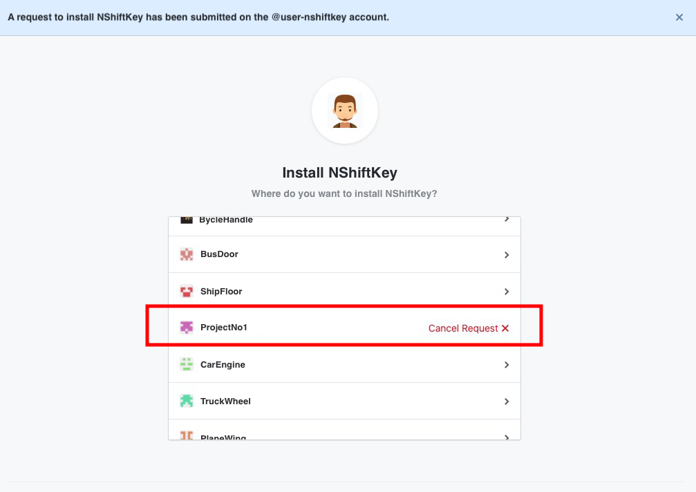

### What is good to use with NShiftKey?

NShiftKey is a DevSecOps service that provides continuous security capabilities that enable CI/CD to work together to perform security analysis. All static analyses are automated and convenient. As the analysis result of security vulnerability can be checked through OSS, the analysis history can be easily checked, and security vulnerabilities related to open source in development can be identified at a glance. It automatically reports any newly discovered vulnerabilities in the open source.

### Is there anything I need to install to use NShiftKey?

It is possible to install or delete NShiftKey in the OSS repo under development with just a few clicks and automatically register the analysis results with OSS once installed.
[How to install](https://naver.github.io/nshiftkey-doc/0-getting-started/getting_started/)

### Does NShiftKey slow down DevOps' development spped?

NShiftKey is an automated security analysis system that informs analysis results from seconds to seconds, depending on the source code and service being developed. The analysis also shows how to eliminate the vulnerability and the time it takes to fix it. If vulnerabilities exist, repository becomes impossible to merge, but if necessary, they can also be ignored. [(Ignore Issues)](https://naver.github.io/nshiftkey-doc/4-best-practice/ignore_issues/) As a result, it will take more time than traditional developments, but it will take very little time compared to performing a security analysis by security manager and informing you of the results.

### What kind of programming language does NShiftKey support?

See here the language in which NShiftKey supports static analysis. [Static Analysis Requirement](https://naver.github.io/nshiftkey-doc/1-static-analysis/requirement/). In case of open source, please refer to here. [Open Source Analysis Requirement](https://naver.github.io/nshiftkey-doc/2-opensource-analysis/requirement/)

### How does NShiftKey check programming language when analyzing the repository?

NShiftKey uses the github API to get language list information of the repository. And NShiftKey performs analysis for each language based on the language information contained in the list. Github API guesses development language based on Linguist library, please refer to the following link for details.
https://help.github.com/en/articles/about-repository-languages

### Can NShiftKey perform analysis for each branch?

A static analysis of NShiftKey performs the analysis based on the branch selected when performing PR.

### Is there a function to analyze Swift code?

Currently, NShiftKey does not support analyzing the source code vulnerability of Swift and supports open source vulnerabilities or sensitive information disclosure checking. We will provide the function to analyze the source code vulnerability of Swift in the future.

### When does NShiftKey perform the analysis?

NShiftKey performs the analysis when developer makes PR and there is a way to set analysis timing via issue template.

### Can I set it not to be merge when a security vulnerability occurs?
Go to "Settings->Branches->Branch protection rules->Add" and check "Require status checks to pass before merging" and "Require branches to be up to date before merging". Then you can set the rule not to be merged if security vulnerability occures.

### Can I keep NShiftKey even if I change the name of Repo?

If the repository name is changed, the installed NShiftKey is deleted. Reinstallation is required for NShiftKey.

### Can NShiftKey be maintained even if I transfer ownership of repo?

Transferring ownership from repository will delete the installed NShiftKey. Reinstallation is required for NShiftKey.

### Does NShiftKey find all the security vulnerabilities?

No existing analytical system can detect all security vulnerabilities perfectly, and NShiftKey cannot detect all security vulnerabilities as well. Therefore, even if you use NShiftKey, you must perform separate security assessment, especially before the service is released.

### When the detection result is false-alram or internally known issue, we want to keep that issue invisible in future analyses. Is there any solution?

If you press "Make into access" button after each detected item, you can disable issues. However, if there are additional modifications to the code part associated with this item, it will be detected again.

### If I fork a repository to private account and apply the results to main repository, should security-checker be installed in the forked repository?

No, if the security-checker is installed in main repository, you do not need to install it in forked repository.

### I can't install the app as the screen below appears.

If you do not have permission to install the app, it appears as Request, not Install. You can install the app by obtaining owner rights of organization or accepted by owner. Organization's owner can accept the request at \[Settings\]->\[Installed GitHub Apps\].

### Does NShiftKey make false-alarm?

Like other security analysis tools, NShiftKey's analysis results have false-alarm. NShiftKey is an automated analytics system, so if too many false-alarms occur, developers can think of detection results as unimportant, so detections are focused on high-severity and critical security vulnerabilities. If you give us a feedback on certain false-alarm, it will help us improve our NShiftKey detection performance. In addition, please contact us for improvements, questions, and bugs below.

> [Official channel](https://github.com/naver/nshiftkey-doc/issues)

